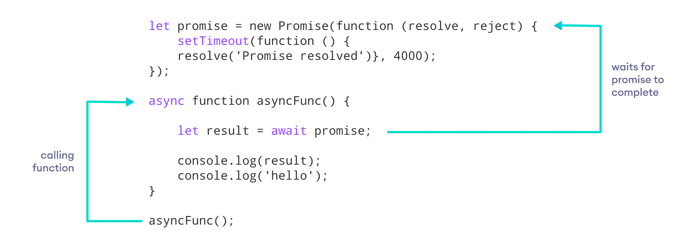

# Async / Await



JavaScript async Keyword
We use the async keyword with a function to represent that the function is an 
asynchronous function. The async function returns a promise.
JavaScript await Keyword
The await keyword is used only inside the async function to wait for the asyn
chronous operation.
Benefits of Using async Function
- The code is more readable than using a callback or a promise.
- Error handling is simpler.
- Debugging is easier.
```js
async function obtenerDatos() {
    try {
        const response = await 
fetch('https://jsonplaceholder.typicode.com/posts/1');
        if (!response.ok) {
            throw new Error('Error en la solicitud');
        }
        const data = await response.json();
        console.log(data);
    } catch (error) {
        console.error('Hubo un problema:', error);
    }
}
obtenerDatos();
```
