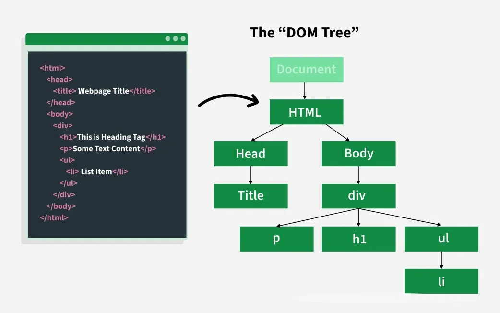

# Browser APIs & Storage

## Window

`window` is a global object that represents the browser window where the JavaScript code runs in a browser environment.

Key Characteristics of `window`:
- **Global Object**: Contains properties and methods that can be used anywhere in your code.
- **Access to DOM Elements**: Provides access to everything related to the browser's user interface.

Common Methods and Properties:
- `window.alert()` - Displays an alert box in the browser.
- `window.confirm()` - Displays a confirmation dialog box.
- `window.prompt()` - Displays a dialog box asking the user for input.
- `window.setTimeout()` - Executes a function after a specified time interval.
- `window.setInterval()` - Repeatedly executes a function with a specified time interval.
- `window.clearTimeout()` and `window.clearInterval()` - Cancel timeouts or intervals set with `setTimeout()` and `setInterval()`.
- `window.location` - Contains information about the current URL and allows changing the URL.
- `window.document` - Provides access to the DOM of the current page.
- `window.localStorage` and `window.sessionStorage` - Provide data storage in the browser.
- `window.innerWidth` and `window.innerHeight` - Return the dimensions of the browser window.
- `window.console` - Provides access to the console for debugging (e.g., `console.log()`).

Common Window Events:
- `resize` - Fired when the window is resized.
- `scroll` - Fired when the user scrolls the window's content.
- `load` - Fired when the window and all its resources are fully loaded.

## Self

En el contexto de los navegadores web, `self` es una referencia global al objeto global de la ventana (el objeto `window`). `self` y `window` son equivalentes en los navegadores.

```js
self.alert("Hello!"); // Es equivalente a window.alert("Hello!")
console.log(self === window); // true
self.console.log("Using self!"); // Funciona igual que window.console.log
```

## Global

In a browser environment, the global object is `window`. In Node.js, the global object is called `global`.

Key Methods and Properties in Node.js:
- `global.setTimeout()` / `global.clearTimeout()`
- `global.setInterval()` / `global.clearInterval()`
- `global.process` - Provides information and control over the current Node.js process.
- `global.console` - Provides access to the standard output and error streams.
- `global.Buffer` - Represents binary data buffers.
- `global.require` - Function to load modules.

## Fetch API

Es una interfaz moderna que permite realizar solicitudes HTTP (GET, POST, PUT, DELETE) de manera asíncrona desde el navegador hacia un servidor.

Basada en Promesas: `fetch` devuelve una promesa que se resuelve con la respuesta de la solicitud.

Manejo de CORS: `fetch` respeta las políticas de CORS.

```js
fetch('https://jsonplaceholder.typicode.com/posts/1')
    .then(response => {
        if (!response.ok) {
            throw new Error('Error en la solicitud: ' + response.statusText);
        }
        return response.json();
    })
    .then(data => {
        console.log(data);
    })
    .catch(error => {
        console.error('Hubo un problema con la solicitud:', error);
    });
```

### Opciones de Configuración en fetch

El segundo argumento opcional de `fetch` es un objeto de configuración:
- `method`: El método HTTP (GET, POST, PUT, DELETE).
- `headers`: Objeto con los encabezados HTTP.
- `body`: El cuerpo de la solicitud.
- `mode`: 'cors', 'no-cors', o 'same-origin'.
- `credentials`: 'omit', 'same-origin', o 'include'.
- `cache`: 'default', 'no-store', 'reload', 'no-cache', 'force-cache', o 'only-if-cached'.

```js
fetch('https://jsonplaceholder.typicode.com/posts/1', {
    method: 'GET',
    headers: {
        'Content-Type': 'application/json',
        'Authorization': 'Bearer token'
    }
})
    .then(response => response.json())
    .then(data => console.log(data))
    .catch(error => console.error('Error:', error));
```

## Cookies

Las cookies son pequeños fragmentos de datos almacenados por el navegador en el equipo del usuario.

### Estructura de una cookie

```
name=value; Expires=date; Max-Age=seconds; Domain=domain; Path=path; Secure; HttpOnly; SameSite=strict/lax/none
```

```js
document.cookie = "sessionID=abcd1234; Domain=example.com; Path=/users; Expires=Wed, 31 Dec 2025 23:59:59 GMT; Secure; HttpOnly; SameSite=Strict";
```

### Crear y establecer una cookie

```js
document.cookie = "username=JohnDoe; Max-Age=3600; Path=/; Secure; SameSite=Strict";
```

### Leer cookies

```js
console.log(document.cookie);
// "username=JohnDoe; theme=dark"
```

### Función para acceder a una cookie específica

```js
function getCookie(name) {
    let cookies = document.cookie.split(';');
    for (let cookie of cookies) {
        let [key, value] = cookie.trim().split('=');
        if (key === name) {
            return decodeURIComponent(value);
        }
    }
    return null;
}

console.log(getCookie("username")); // "JohnDoe"
```

### Actualizar una cookie

```js
document.cookie = "username=JaneDoe; Max-Age=7200; Path=/";
```

### Eliminar una cookie

```js
document.cookie = "username=; Expires=Thu, 01 Jan 1970 00:00:00 UTC; Path=/;";
```

### Configuración entre dominios (CORS)

Backend:
```js
app.get('/set-cookie', (req, res) => {
    res.cookie('sessionID', 'abcd1234', {
        httpOnly: true,
        secure: true,
        sameSite: 'None',
        domain: 'example.com',
        path: '/',
        maxAge: 24 * 60 * 60 * 1000,
    });
    res.status(200).send('Cookie enviada');
});
```

Frontend:
```js
fetch('https://api.example.com/set-cookie', {
    method: 'GET',
    credentials: 'include',
})
    .then((response) => response.text())
    .then((data) => console.log(data))
    .catch((error) => console.error('Error:', error));
```

Configuración CORS en el backend:
```js
const cors = require('cors');
app.use(
    cors({
        origin: 'https://frontend.com',
        credentials: true,
    })
);
```

## Data Storage

Modern storage APIs like Web Storage API (`localStorage` and `sessionStorage`) and IndexedDB are recommended over cookies for client-side data storage.

## Local Storage

Key Characteristics:
- **Capacity**: 5–10 MB per domain.
- **Persistence**: Data does not expire.
- **Synchronous**: All operations are synchronous.
- **String-based**: Only stores strings.

```js
// Storing data
localStorage.setItem('username', 'JohnDoe');
localStorage.setItem('theme', 'dark');

// Retrieving data
const username = localStorage.getItem('username'); // "JohnDoe"
console.log(username);

// Updating data
localStorage.setItem('username', 'JaneDoe');

// Deleting specific data
localStorage.removeItem('username');

// Clearing all data
localStorage.clear();
```

Storing Non-String Data:
```js
const user = { name: 'John', age: 30 };
localStorage.setItem('user', JSON.stringify(user));

const userData = JSON.parse(localStorage.getItem('user'));
console.log(userData.name); // "John"
```

## Session Storage

Key Characteristics:
- **Scope**: Data is specific to a single browser tab or window.
- **Persistence**: Data persists only until the tab or window is closed.
- **Capacity**: 5–10 MB per domain.
- **String-based**: Only stores strings.

```js
// Storing data
sessionStorage.setItem('username', 'JohnDoe');
sessionStorage.setItem('theme', 'dark');

// Retrieving data
const username = sessionStorage.getItem('username'); // "JohnDoe"
console.log(username);

// Updating data
sessionStorage.setItem('username', 'JaneDoe');

// Deleting specific data
sessionStorage.removeItem('username');

// Clearing all data
sessionStorage.clear();
```

Storing Non-String Data:
```js
const user = { name: 'John', age: 30 };
sessionStorage.setItem('user', JSON.stringify(user));

const userData = JSON.parse(sessionStorage.getItem('user'));
console.log(userData.name); // "John"
```

### Best Practices

- Avoid storing sensitive data (passwords, tokens) in Storage APIs.
- Check browser availability:
```js
if (typeof sessionStorage !== 'undefined') {
    console.log('Session Storage is available');
}
```

## IndexedDB

IndexedDB is a low-level API for client-side storage of significant amounts of structured data, including files and blobs.

Key Features:
- **Asynchronous**: Doesn't block the main thread.
- **Persistent**: Data persists after browser is closed.
- **Indexed**: Supports efficient searches using indexes.
- **Large Storage**: Can store large amounts of data.
- **Transactions**: All operations are part of a transaction.

### Opening or Creating a Database

```js
const request = indexedDB.open('MyDatabase', 1);

request.onupgradeneeded = (event) => {
    const db = event.target.result;
    const objectStore = db.createObjectStore('users', { keyPath: 'id' });
    objectStore.createIndex('name', 'name', { unique: false });
};

request.onsuccess = (event) => {
    const db = event.target.result;
    console.log('Database opened:', db);
};

request.onerror = (event) => {
    console.error('Database error:', event.target.error);
};
```

### Adding Data

```js
const db = request.result;
const transaction = db.transaction('users', 'readwrite');
const objectStore = transaction.objectStore('users');

objectStore.add({ id: 1, name: 'John Doe', age: 30 });
objectStore.add({ id: 2, name: 'Jane Doe', age: 25 });

transaction.oncomplete = () => console.log('Transaction complete');
transaction.onerror = (event) => console.error('Transaction error:', event.target.error);
```

### Reading Data

```js
const transaction = db.transaction('users', 'readonly');
const objectStore = transaction.objectStore('users');

const request = objectStore.get(1);
request.onsuccess = () => console.log('Data:', request.result);

const index = objectStore.index('name');
const query = index.get('Jane Doe');
query.onsuccess = () => console.log('Query Result:', query.result);
```

### Updating Data

```js
const transaction = db.transaction('users', 'readwrite');
const objectStore = transaction.objectStore('users');

objectStore.put({ id: 1, name: 'John Smith', age: 35 });

transaction.oncomplete = () => console.log('Update complete');
```

### Deleting Data

```js
const transaction = db.transaction('users', 'readwrite');
const objectStore = transaction.objectStore('users');

objectStore.delete(1);
objectStore.clear();

transaction.oncomplete = () => console.log('Delete complete');
```

### Deleting a Database

```js
const deleteRequest = indexedDB.deleteDatabase('MyDatabase');
deleteRequest.onsuccess = () => console.log('Database deleted');
deleteRequest.onerror = (event) => console.error('Delete error:', event.target.error);
```

## DOM (Document Object Model)



It is a programming interface that allows us to modify elements from the document. The HTML DOM is a standard for how to get, change, add, or delete HTML elements.

### Accessing DOM Elements

```js
const headerElement = document.getElementById('header');
const paragraphs = document.getElementsByClassName('paragraph');
const images = document.getElementsByTagName('img');
```

### Modifying Element Content

```js
headerElement.innerHTML = 'New Header Text';
```

### Events and Event Handling

```js
const myButton = document.getElementById('myButton');
myButton.addEventListener('click', function () {
    alert('Button Clicked!');
});
```

### Manipulating Styles

```js
const myParagraph = document.getElementById('myParagraph');
const colorButton = document.getElementById('colorButton');

colorButton.addEventListener('click', function () {
    myParagraph.style.color = 'blue';
});
```

### Creating New Elements

```js
const newParagraph = document.createElement('p');
newParagraph.textContent = 'This is a new paragraph.';
document.body.appendChild(newParagraph);
```

### Modifying Attributes

```js
const myImage = document.getElementById('myImage');
myImage.src = 'new-image.jpg';
```

### Updating Form Input Values

```js
const myInput = document.getElementById('myInput');
myInput.addEventListener('input', function () {
    document.getElementById('inputValue').textContent = myInput.value;
});
```

### Toggling Visibility

```js
const toggleButton = document.getElementById('toggleButton');
const toggleParagraph = document.getElementById('toggleParagraph');

toggleButton.addEventListener('click', function () {
    toggleParagraph.style.display = toggleParagraph.style.display === 'none' ? 'block' : 'none';
});
```

### DOMContentLoaded

```js
document.addEventListener('DOMContentLoaded', function () {
    // DOM manipulation code goes here
});
```

### Checking if an Element Exists

```js
const myElement = document.getElementById('myElement');
if (myElement) {
    // Manipulate the element here
} else {
    console.error('Element not found!');
}
```

### Preventing Default Actions

```js
const myForm = document.getElementById('myForm');
myForm.addEventListener('submit', function (event) {
    event.preventDefault();
    // Your form handling code goes here
});
```