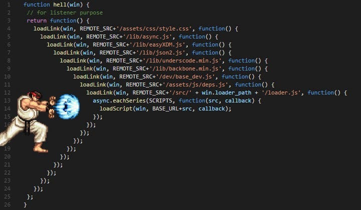

# JavaScript Callback Function

A callback is a function that is passed as an argument to another function and is executed after some operation has been completed. Callbacks are often used for handling asynchronous operations, such as reading files, making API requests, or handling events like user input.

## Synchronous Callback

```js
function greet(name, callback) {
    console.log("Hello, " + name + "!");
    callback();
}
function sayGoodbye() {
    console.log("Goodbye!");
}
greet("Alice", sayGoodbye);
```

## Asynchronous Callback

This example shows an asynchronous operation using setTimeout, where the callback is executed after a delay.

```js
function fetchData(callback) {
    console.log("Fetching data...");
    setTimeout(() => {
        console.log("Data fetched.");
        callback();
    }, 2000);
}
function processData() {
    console.log("Processing data...");
}
fetchData(processData);
```

Output:
```
Fetching data...
Data fetched.
Processing data...
```

## Callback Hell



Callback Hell es un término que describe una situación en la programación, especialmente en JavaScript, donde tienes múltiples funciones asíncronas que dependen unas de otras. Cuando estas funciones se manejan usando callbacks, el código puede volverse anidado y difícil de leer y mantener. Este anidamiento excesivo se conoce como "Callback Hell" o "Pyramid of Doom".
