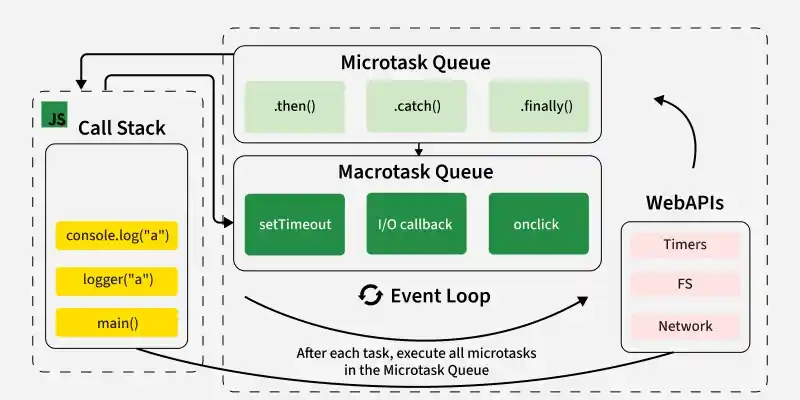

# Event Loop & Async Patterns

Código Síncrono
En un entorno síncrono, las operaciones se ejecutan una tras otra, en el orden 
en  que  están  escritas.  Esto  significa  que  cada  línea  de  código  debe 
completarse antes de que la siguiente pueda comenzar.
```js
console.log('Inicio');
function tareaPesada() {
  // Simulando una tarea que toma tiempo
  for (let i = 0; i < 1e9; i++) {}
  console.log('Tarea pesada completada');
}
tareaPesada();
console.log('Fin');
```
Resultado:
Inicio
Tarea pesada completada
Fin
Características del Código Síncrono:
- Bloqueante: Si una operación tarda mucho, bloquea la ejecución del 
resto del código.
- Predecible: El flujo de ejecución es lineal y fácil de seguir.

Código Asíncrono
En un entorno asíncrono, algunas operaciones pueden iniciarse, y mientras 
están  en  progreso,  otras  operaciones  pueden  ejecutarse.  Esto  es 
especialmente útil para operaciones que pueden tardar en completarse, como 
solicitudes de red, temporizadores, o leer archivos.
```js
console.log('Inicio');
setTimeout(() => {
    console.log('Tarea asíncrona completada');
}, 2000); // 2 segundos
console.log('Fin');
```
Resultado:
Inicio
Fin
Tarea asíncrona completada
Características del Código Asíncrono:
- No bloqueante: Las operaciones asíncronas permiten que el código 
continúe ejecutándose mientras se espera a que se completen.
- Impredecible: El orden de ejecución no es siempre secuencial, ya que 
depende de cuándo se completen las tareas asíncronas.

Event Loop
The Event Loop is the mechanism that allows JavaScript to handle asyn
chronous, non-blocking operations despite being a single-threaded language. 
It ensures that code execution, event handling, and asynchronous tasks are 
coordinated efficiently through a task queue and other components.



Key Components of the Event Loop
1. Call Stack:
- A LIFO (Last In, First Out) structure where functions are executed.
- When a function is invoked, it gets pushed onto the Call Stack.
- When the function completes execution, it is popped off the stack.
2. Web APIs (macrotasks):
- These are features provided by the environment (browser or Node.js) 
such as setTimeout, fetch, DOM events, etc.
- Asynchronous operations are delegated to these APIs, not directly ex
ecuted in the Call Stack.
3. Task Queue (also called Callback Queue or Macrotask Queue):
- A queue that holds tasks (callbacks) ready to run after the Call Stack 
is empty.
- Examples of tasks: setTimeout or setInterval callbacks.

> **Nota:** Task Queue = Callback Queue = Macrotask Queue. Los tres nombres se refieren a la misma cola. Se diferencia de la **Microtask Queue** (Promises, queueMicrotask) que tiene prioridad y se vacía antes de pasar a la Task Queue.

4. Microtask Queue:
- A queue with higher priority than the Task Queue.
- Examples:  resolved  Promise.then  handlers,  MutationObserver  call
backs.
- Microtasks are processed after the current code execution and before 
moving to the Task Queue.
5. Event Loop:
- Continuously monitors the Call Stack and queues.

- If the Call Stack is empty, it pushes tasks from the Microtask Queue or 
Task Queue into the stack for execution.

## Event Loop Execution Flow
1. Start:
- The Call Stack starts empty.
- The JavaScript engine (like V8 in Chrome) loads your script and exe
cutes it line by line, stacking functions in the Call Stack as they are 
called.
2. Execute Synchronous Code:
- All synchronous tasks are executed immediately in the Call Stack.
3. Encounter an Asynchronous Task:
- If an asynchronous operation (like setTimeout) is encountered, it’s del
egated to Web APIs.
- Once the Web API finishes its operation (e.g., waiting for a timer), it 
sends the associated callback to the Task Queue.

4. Microtask Queue First:
- When the Call Stack is empty, the Event Loop processes all tasks in the 
Microtask Queue before tasks in the Task Queue.
5. Process the Task Queue:
- If there are no microtasks, the Event Loop picks the first task from the 
Task Queue and pushes it onto the Call Stack.
```js
console.log('Start');
setTimeout(() => {
    console.log('Timeout 1');
}, 0);
Promise.resolve().then(() => {
    console.log('Promise 1');
}).then(() => {
    console.log('Promise 2');
});
setTimeout(() => {
    console.log('Timeout 2');
}, 0);
console.log('End');
```
```
Start
End
Promise 1
Promise 2
Timeout 1
Timeout 2
```

### Step-by-Step Execution

1. **Synchronous Code** — `console.log('Start')` executes immediately.  
   Output: `Start`

2. **First setTimeout** — The callback (Timeout 1) is delegated to the Web API and added to the Task Queue after 0 ms.

3. **Promise Chain** — `Promise.resolve().then()` callback (Promise 1) is added to the Microtask Queue.  
   The next `.then()` (Promise 2) is added after Promise 1 executes.

4. **Second setTimeout** — Its callback (Timeout 2) is added to the Task Queue after 0 ms.

5. **Final Synchronous Code** — `console.log('End')` executes immediately.  
   Output: `End`

6. **Microtask Queue** — After the Call Stack is empty:  
   Promise 1 executes → Output: `Promise 1`  
   Promise 2 executes → Output: `Promise 2`

7. **Task Queue** — After the Microtask Queue is empty:  
   Timeout 1 executes → Output: `Timeout 1`  
   Timeout 2 executes → Output: `Timeout 2`

### Event Loop Parts

```
┌─────────────┐
│ Call Stack  │
└─────────────┘
       ↓
┌─────────────────────────────────────┐
│ Web APIs (DOM, Timers, fetch, etc.) │
└─────────────────────────────────────┘
       ↓
┌──────────────────────────────────────┐
│ Callback Queues                      │
│  – Microtask Queue (Promise, etc.)   │
│  – Macrotask Queue (setTimeout, etc.)│
└──────────────────────────────────────┘
       ↓
┌─────────────┐
│ Event Loop  │
└─────────────┘
```

#### Function of each

- **Call Stack** — Where synchronous JavaScript code is executed.
- **Web APIs** — Handle asynchronous tasks like setTimeout, fetch, addEventListener, etc.
- **Microtask Queue** — For `Promise.then()`, `queueMicrotask()`, etc.
- **Macrotask Queue** — For `setTimeout()`, DOM events, etc.
- **Event Loop** — Monitors and moves tasks from the callback queue to the call stack when it is free.

## Other Related Concepts

### Modelo de Concurrencia en JavaScript

JavaScript es un lenguaje single-threaded (de un solo hilo), lo que significa que solo puede hacer una cosa a la vez en su flujo principal de ejecución. Sin embargo, a través de la asincronía, JavaScript puede gestionar múltiples tareas de manera eficiente, permitiendo que las operaciones que toman tiempo (como solicitudes de red, temporizadores, etc.) se ejecuten sin bloquear el hilo principal.

### V8

V8 is Google's open-source JavaScript engine, used in Chrome and Node.js. It compiles JavaScript to native machine code for fast execution. It includes:
- **Call Stack** — For managing function calls.
- **Heap** — For memory allocation (storing objects and data structures).

### Call Stack

A data structure that tracks the active function calls.

- When a function is called, it's added to the top of the stack.
- When the function finishes, it's removed from the stack.
- If the stack is empty, the event loop checks the callback queue for tasks.

Blocking happens if a function on the stack takes a long time to execute, preventing other code from running.

### Callback Queue

A queue where callbacks (functions) waiting to be executed are stored.

When asynchronous operations (e.g., setTimeout, fetch) complete, their callbacks are added to the queue. The event loop dequeues a callback and moves it to the call stack only when the stack is empty.

### Web APIs

Browser-provided features (or Node.js equivalents) like setTimeout, fetch, and DOM events.

These APIs handle tasks asynchronously outside the main thread. When they finish, they place their callbacks into the callback queue (or other queues, like the microtask queue).

### Heap

A region of memory used for storing objects and variables. Large data structures are stored here and accessed during code execution.

### Asynchronous

Code that doesn't block the call stack.

Examples:
- `setTimeout` schedules a task for later.
- `fetch` performs a network request.

Ensures non-blocking operations by delegating tasks to Web APIs.

### Concurrency

JavaScript's ability to manage multiple tasks simultaneously, despite being single-threaded.

While one task is running on the call stack, other tasks (e.g., fetch, timers) can progress in Web APIs. When ready, these tasks queue callbacks for execution, ensuring efficient handling of multiple operations.

### Blocking

Code that keeps the call stack occupied, preventing other tasks from running.

Example: A `while` loop running indefinitely. It stops the event loop from processing callbacks, causing performance issues.

