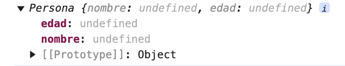
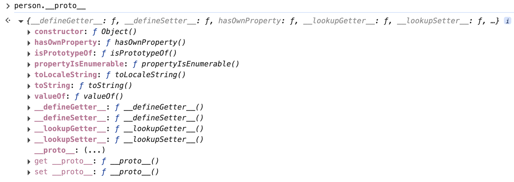

# Prototypes & Classes

## Prototypes

A prototype is an internal object from which other objects inherit properties and methods.
In JavaScript, every object has an internal property called [[Prototype]] (often accessible via __proto__).

- `__proto__`: A property of objects that points to their prototype, deprecated in favor of `Object.getPrototypeOf()`

When you try to access a property or method on an object and it doesn't exist in that object, JavaScript looks for it in the object's prototype. If it's not found there, it continues searching up the chain of prototypes until it reaches the base object, Object.prototype.

Object.prototype is a built-in object from which all other objects inherit. It acts as the "parent" of all objects in JavaScript. The prototype of Object.prototype is null, which indicates the end of the prototype chain.

### Object.prototype methods

- `toString()`: Converts an object to a string representation.
- `valueOf()`: Returns the primitive value of an object.
- `hasOwnProperty(prop)`: Checks if an object directly owns a given property.
- `isPrototypeOf(obj)`: Checks if the current object is in the prototype chain of another object.
- `propertyIsEnumerable(prop)`: Checks if a property is enumerable on the object.

### How Prototypes Work

- **Prototype Chain**: When you try to access a property on an object, JavaScript first looks for it on the object itself. If not found, it looks up the prototype chain until it finds the property or reaches the end of the chain (where the prototype is null).
- **Constructor Functions**: When you create an object using a constructor function (with new), the new object's prototype is set to the constructor's prototype property.

### Accessing an Object's Prototype

```js
const person = {
    name: 'John',
    greet: function () {
        console.log('Hello, ' + this.name);
    }
};
console.log(person.__proto__);
// person.__proto__ points to Object.prototype, the default prototype for all objects
```

### Prototype with Constructor Functions

Constructor functions have a prototype (Constructor.prototype). This prototype is used to share methods among all instances created by that constructor.

```js
function Person(name, age) {
    this.name = name;
    this.age = age;
}

Person.prototype.greet = function () {
    console.log(`Hello, my name is ${this.name} and I'm ${this.age} years old.`);
};

const john = new Person('John', 30);
john.greet(); // Hello, my name is John and I'm 30 years old.

const mary = new Person('Mary', 25);
mary.greet(); // Hello, my name is Mary and I'm 25 years old.
```

The john object has a prototype chain:
- `john.__proto__` points to `Person.prototype`
- `Person.prototype.__proto__` points to `Object.prototype`
- `Object.prototype.__proto__` points to `null`

### The Prototype of Object

All JavaScript objects inherit from Object.prototype (unless created explicitly without a prototype using Object.create(null)).

```js
const obj = { name: 'Object' };
console.log(obj.__proto__ === Object.prototype); // true
```

### Modifying an Object's Prototype

You can modify a constructor's prototype to add methods to all instances.

```js
function Animal(name) {
    this.name = name;
}

Animal.prototype.speak = function () {
    console.log(this.name + ' makes a sound.');
};

const dog = new Animal('Dog');
dog.speak(); // Dog makes a sound.

Animal.prototype.speak = function () {
    console.log(this.name + ' barks.');
};

const cat = new Animal('Cat');
cat.speak(); // Cat barks.
```

### `__proto__` vs `prototype`

- `__proto__`: A property of objects used to access the prototype of an object.
- `prototype`: A property of constructor functions that defines what is shared among all instances.

```js
function Car(make, model) {
    this.make = make;
    this.model = model;
}

const myCar = new Car('Toyota', 'Corolla');
console.log(myCar.__proto__ === Car.prototype); // true
```

> Note: `.__proto__` is a legacy feature and should not be used in production code.

### Prototype Inheritance

```js
function Animal(name) {
    this.name = name;
}

Animal.prototype.speak = function () {
    console.log(`${this.name} makes a sound.`);
};

function Dog(name, breed) {
    Animal.call(this, name);
    this.breed = breed;
}

Dog.prototype = Object.create(Animal.prototype);
Dog.prototype.constructor = Dog;

Dog.prototype.bark = function () {
    console.log(`${this.name}, the ${this.breed}, barks!`);
};

const myDog = new Dog('Buddy', 'Golden Retriever');
myDog.speak(); // Buddy makes a sound.
myDog.bark();  // Buddy, the Golden Retriever, barks!

console.log(myDog instanceof Dog);    // true
console.log(myDog instanceof Animal); // true
```

```js
function Parent(name) {
    this.name = name;
}

Parent.prototype.greet = function () {
    console.log(`Hello, I am ${this.name}.`);
};

function Child(name, age) {
    Parent.call(this, name);
    this.age = age;
}

Child.prototype = Object.create(Parent.prototype);
Child.prototype.constructor = Child;

Child.prototype.sayAge = function () {
    console.log(`I am ${this.age} years old.`);
};

const child = new Child("Alice", 10);
child.greet();   // "Hello, I am Alice."
child.sayAge();  // "I am 10 years old."
```

### Prototype Chain




When you access a property or method on an object:
1. JavaScript first looks for it on the object itself.
2. If not found, it looks at the object's [[Prototype]].
3. This continues up the chain until it reaches Object.prototype.
4. If it's not there, it returns undefined.

```js
const obj = {};
console.log(obj.toString()); // [object Object]
console.log(obj.__proto__); // Object.prototype
console.log(Object.prototype.__proto__); // null
```

### Prototype Methods

#### Object.create(proto)

Creates a new object with the specified prototype.

```js
const animal = {
    type: 'Animal',
    makeSound() {
        console.log('Generic animal sound');
    }
};

const dog = Object.create(animal);
dog.bark = function () {
    console.log('Woof!');
};

console.log(dog.type); // "Animal" (inherited)
dog.makeSound(); // "Generic animal sound" (inherited)
dog.bark(); // "Woof!"
```

#### Object.getPrototypeOf(obj)

Retrieves the prototype of a given object.

```js
const animal = {
    type: 'Animal',
};

const dog = Object.create(animal);
console.log(Object.getPrototypeOf(dog)); // {type: 'Animal'}
console.log(dog.__proto__); // {type: 'Animal'}
```

#### Object.setPrototypeOf(obj, proto)

Sets the prototype of a specified object. Warning: this is a slow operation.

```js
const originalPrototype = { greeting: "Hello" };
const myObject = Object.create(originalPrototype);
const newPrototype = { farewell: "Goodbye" };

Object.setPrototypeOf(myObject, newPrototype);
console.log(myObject.greeting); // undefined
console.log(myObject.farewell); // "Goodbye"
```

#### Object.isPrototypeOf(obj)

Checks if an object exists in another object's prototype chain.

```js
const animal = {
    type: 'Animal',
};

const dog = Object.create(animal);
console.log(animal.isPrototypeOf(dog)); // true
console.log(Object.prototype.isPrototypeOf(dog)); // true
console.log(dog.isPrototypeOf(animal)); // false
```

### How to Remove the Prototype of an Object

You can use `Object.setPrototypeOf()` to set an object's prototype to null. This disconnects the object from the prototype chain.

**Effects of Removing the Prototype:**
- Methods like toString(), hasOwnProperty(), or isPrototypeOf() will no longer be available.
- The object becomes a completely flat object with no access to the prototype chain.
- You won't be able to use many built-in JavaScript methods that rely on the prototype chain.

**Why Is It Not Recommended?**
- Disrupts expected object behavior.
- Prototypes are a powerful mechanism for sharing properties and methods between objects.

## JavaScript OOP

There are 4 main principles in OOP:
- **Abstraction**: Hiding certain details that don't matter to the user and only showing essential features.
- **Encapsulation**: Keeping properties and methods private inside a class.
- **Inheritance**: Making all properties and methods available to a child class.
- **Polymorphism**: Having different forms. We can override a method inherited from a parent class.

### Method Overriding

```js
class Animal {
    speak() {
        console.log("Generic animal sound");
    }
}
class Dog extends Animal {
    speak() {
        console.log("Woof!");
    }
}

const myDog = new Dog();
myDog.speak(); // Woof!
const myAnimal = new Animal();
myAnimal.speak(); // Generic animal sound
```

## Classes

A class is a template for creating objects that encapsulates data (properties) and behavior (methods).

### Key Features of Classes

- **Constructor Method**: Special method for creating and initializing objects. Called automatically with `new`.
- **Methods**: Functions defined inside the class.
- **Inheritance**: Classes can extend other classes using the `extends` keyword.

### Constructor Method

```js
class Car {
    brand = 'Unknown';
    model = 'Unknown';
    year = 0;

    constructor(brand, model, year) {
        this.brand = brand;
        this.model = model;
        this.year = year;
    }

    showDetails() {
        console.log(`Brand: ${this.brand}, Model: ${this.model}, Year: ${this.year}`);
    }
}

const myCar = new Car('Toyota', 'Corolla', 2020);
myCar.showDetails(); // Brand: Toyota, Model: Corolla, Year: 2020

const genericCar = new Car();
genericCar.showDetails(); // Brand: Unknown, Model: Unknown, Year: 0
```

> `let`, `const`, or `var` are not used inside classes because you are defining properties that belong to each instance, not local variables.

### Private Properties

Private properties use the `#` prefix to indicate they cannot be accessed outside the class.

```js
class BankAccount {
    #balance = 0;

    constructor(owner, initialBalance) {
        this.owner = owner;
        if (initialBalance) this.#balance = initialBalance;
    }

    deposit(amount) {
        this.#balance += amount;
    }

    getBalance() {
        return this.#balance;
    }
}
```

**What Does "Private" Mean?**
- Limited Access: Private properties can only be used inside the class where they were defined.
- Encapsulation: Private properties are not visible from outside the class.

```js
class BankAccount {
    #balance = 1000;

    constructor(owner) {
        this.owner = owner;
    }

    getBalance() {
        return this.#balance;
    }
}

const account = new BankAccount("Alice");
// console.log(account.#balance); // ERROR
console.log(account.balance);  // undefined
console.log(account.getBalance()); // 1000
```

### Getters and Setters

Getters and setters control how a property is accessed and modified.

```js
class Person {
    #age;

    constructor(name, age) {
        this.name = name;
        this.#age = age;
    }

    get age() {
        return this.#age;
    }

    set age(newAge) {
        if (newAge > 0) {
            this.#age = newAge;
        } else {
            console.log('Age must be a positive number.');
        }
    }
}

const person = new Person('Ana', 30);
console.log(person.age); // 30
person.age = 25;
console.log(person.age); // 25
person.age = -5; // Age must be a positive number.
console.log(person.age); // 25
```

### Protected Properties

The underscore (`_`) prefix is a convention to indicate a property or method is "protected."

```js
class Animal {
    _name;

    constructor(name) {
        this._name = name;
    }

    _makeSound() {
        console.log(`${this._name} makes a sound`);
    }
}

class Dog extends Animal {
    constructor(name) {
        super(name);
    }

    bark() {
        this._makeSound();
        console.log('Woof!');
    }
}

const myDog = new Dog('Fido');
myDog.bark(); // Fido makes a sound, Woof!
console.log(myDog._name); // Fido
```

### Inheritance with Class Syntax (ES6+)

```js
class Animal {
    constructor(name) {
        this.name = name;
    }

    makeSound() {
        console.log(`${this.name} makes a sound`);
    }
}

class Dog extends Animal {
    constructor(name, breed) {
        super(name);
        this.breed = breed;
    }

    bark() {
        console.log('Woof!');
    }
}

const myDog = new Dog('Fido', 'Labrador');
myDog.makeSound(); // Fido makes a sound
myDog.bark(); // Woof!
console.log(myDog.breed); // Labrador
```

### Static Members

Static properties and methods are associated with the class itself, not with instances.

```js
class MathUtils {
    static PI = 3.14159;

    static calculateCircumference(radius) {
        return 2 * this.PI * radius;
    }
}

console.log(MathUtils.PI); // 3.14159
console.log(MathUtils.calculateCircumference(5)); // 31.4159
```

**Accessing Static Members:** Static members are accessed through the class, not through instances.

```js
class Config {
    static apiUrl = 'https://api.example.com';

    static showUrl() {
        return this.apiUrl;
    }
}

const configInstance = new Config();
console.log(configInstance.apiUrl); // undefined
console.log(configInstance.showUrl()); // undefined
console.log(Config.apiUrl); // https://api.example.com
console.log(Config.showUrl()); // https://api.example.com
```

**Inheritance and Static Members:** Static members are inherited, but accessed through the class or subclass.

```js
class Vehicle {
    static type = 'Vehicle';

    static showType() {
        return this.type;
    }
}

class Car extends Vehicle {}

console.log(Vehicle.showType()); // Vehicle
console.log(Car.showType()); // Vehicle
```
