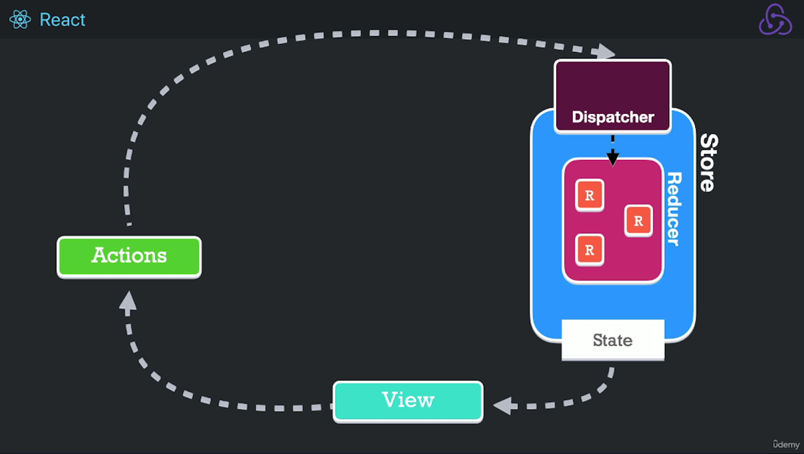
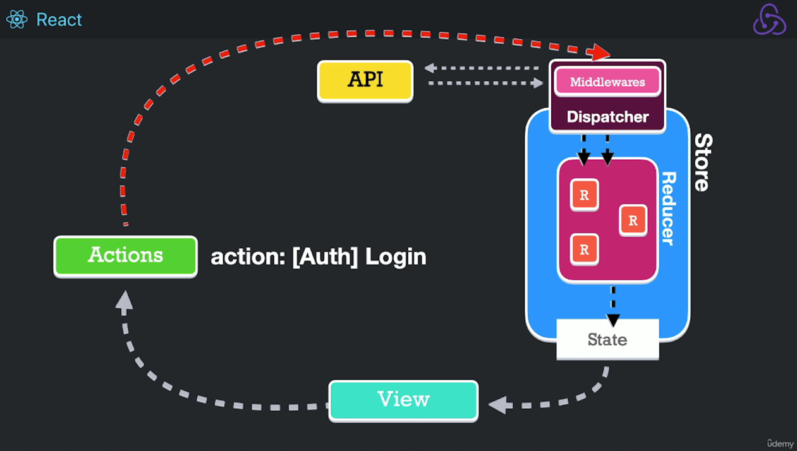

# Redux

## Core Concepts

- **Immutability**: The state in Redux is immutable, meaning it cannot be changed directly. Instead, a new state is created every time a change occurs. This helps avoid side effects and makes debugging easier.
- **Actions**: Actions are plain JavaScript objects that describe what happened in the application. Every action has at least a `type` property, which identifies the action, and optionally a `payload`, which holds the data to update the state. Actions are the only way to send data to the store. Actions are dispatched using `dispatch()`.
- **Reducers**: Reducers are pure functions that take the previous state and an action, and return a new state. They are responsible for specifying how the state changes in response to an action.
- **Unidirectional Data Flow (One-way data flow)**: Redux follows a unidirectional data flow. Actions are dispatched to the store, reducers process the actions and update the state, and then the UI components update based on the new state.

## How does it work?

### Synchronous Flow

1. **Store**: Manages the application's global state.
2. **Actions**: Represents user interactions or external events.
3. **Dispatcher**: Sends actions to the reducers so they can update the store.
4. Store provides state, which is sent to the view.
5. The View triggers an Action.
6. Actions are received by the dispatcher, which forwards them to the appropriate reducer. The reducer then determines how the state should change based on the action type.

### Asynchronous Flow

When consuming an API using Redux, the flow remains similar, but middlewares are introduced to handle asynchronous actions before they reach the reducer.

1. The view triggers an API request by dispatching an async action.
2. Middleware intercepts the action, makes the actual API call, and dispatches new actions based on the API response.
3. The appropriate reducer processes the action and updates the state.
4. Store updates and notifies view.

## Redux Middleware

Middleware is code that runs between the dispatching of an action and the moment it reaches the reducer. It can add functionality like logging, API calls, or side effects.

## Redux Thunk

Thunk is middleware that allows action creators to return functions instead of plain objects, useful for async logic.

For step-by-step guides with code:
- [Redux Traditional Steps](./redux-traditional-steps.md) — JavaScript
- [Redux Traditional TypeScript](./redux-traditional-ts.md) — TypeScript

## Redux Toolkit (RTK)

Redux Toolkit is the official, recommended way to write Redux logic. It reduces boilerplate with helpers like `configureStore()`, `createSlice()`, and `createAsyncThunk()`.

See [Redux Toolkit](./redux-toolkit.md) for the full reference.

## Redux DevTools

Browser extension for debugging Redux state changes, actions, and time-travel debugging.

- Chrome: [Redux DevTools](https://chrome.google.com/webstore/detail/redux-devtools/lmhkpmbekcpmknklioeibfkpmmfibljd)
- Firefox: [Redux DevTools](https://addons.mozilla.org/en-US/firefox/addon/reduxdevtools/)
